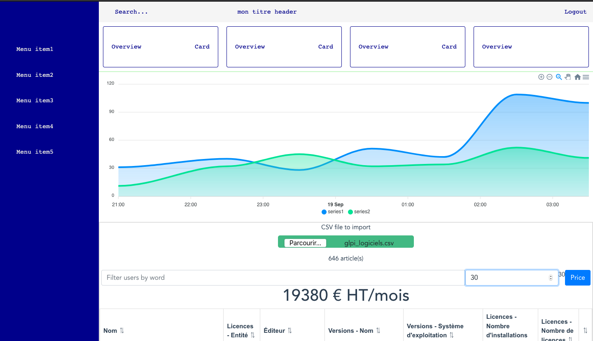

# monitor



Test deploying vueJS webpage

```
vue create monitor
cd monitor
yarn add axios
yarn serve
```


## Project setup
```
yarn install
```

### Compiles and hot-reloads for development
```
yarn serve
```

### Compiles and minifies for production
```
yarn build
```

### Lints and fixes files
```
yarn lint
```

### Customize configuration
See [Configuration Reference](https://cli.vuejs.org/config/).


https://cli.vuejs.org/guide/deployment.html#github-pages

# deploy

create a vue.config.js
```
module.exports = {
  publicPath: '/myglpi/'
}
```
create de deploy.sh with chmod +X deploy.sh right

```
#!/usr/bin/env sh

# abort on errors
set -e

# build
npm run build

# navigate into the build output directory
cd dist

# if you are deploying to a custom domain
# echo 'www.example.com' > CNAME

git init
git add -A
git commit -m 'deploy'

# if you are deploying to https://<USERNAME>.github.io
# git push -f git@github.com:<USERNAME>/<USERNAME>.github.io.git master

# if you are deploying to https://<USERNAME>.github.io/<REPO>
git push -f https://github.com/rim31/myglpi.git master:gh-pages

cd -
```


RUN after push every modification before
```
./deploy.sh
```
